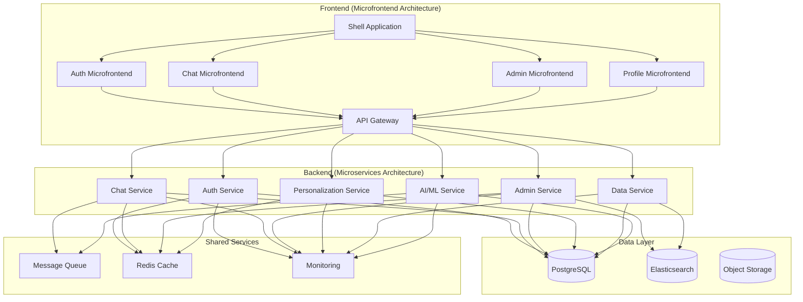
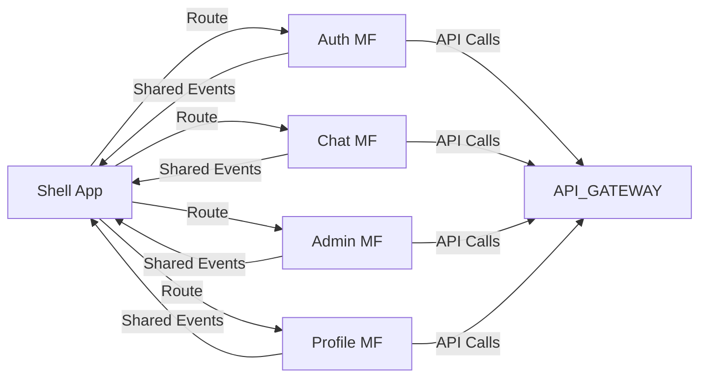
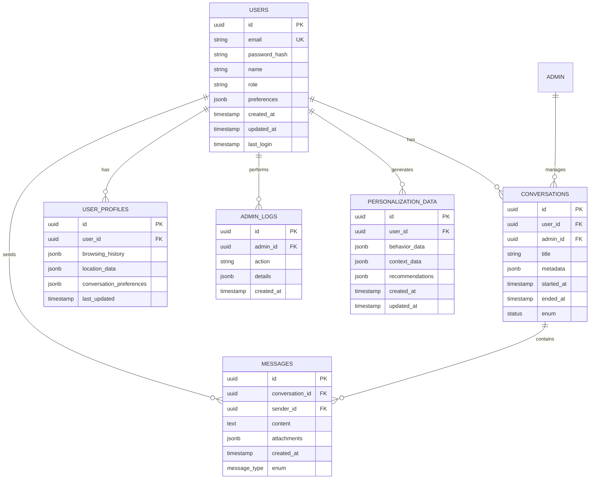
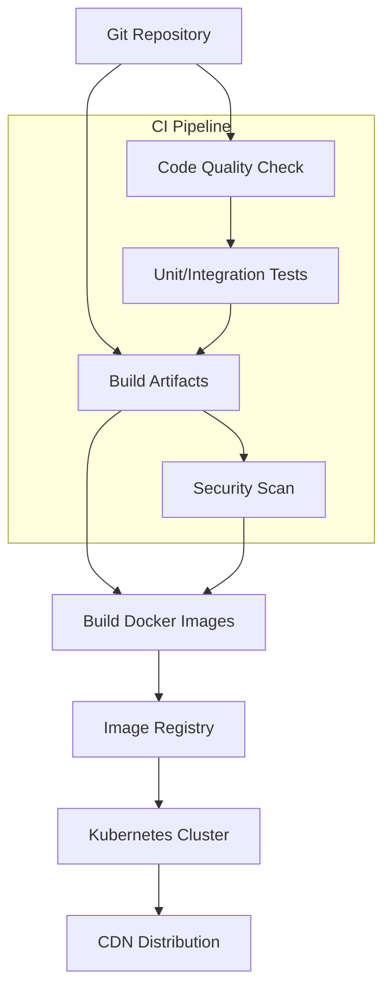
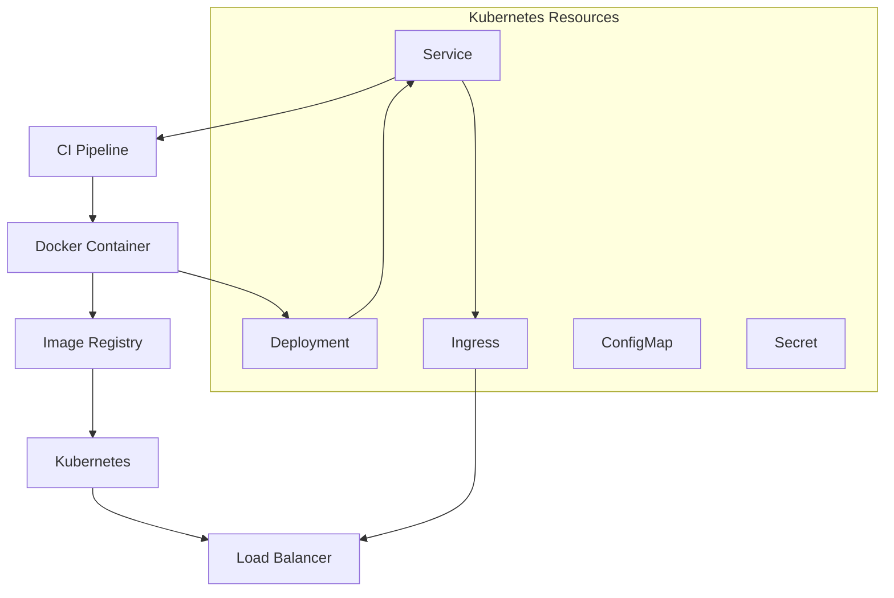

# Chatbot Application Architecture Planning

## Overview

This document outlines the comprehensive architecture for a web-based customer service chatbot application with aggressive personalization features and Apple-inspired UI design. The system follows a microfrontend and microservices architecture for optimal scalability, maintainability, and independent deployment capabilities.

## High-Level Architecture

## Requirements Analysis

### Core Requirements
1. **User & Admin Authentication**: Separate login flows with role-based access control
2. **Chat History Management for Admins**: View, search, export, and delete conversations
3. **Aggressive Personalization**: User profile tracking, context engine, behavior analysis
4. **Apple-Inspired UI Design**: Minimalist interface with smooth animations and accessibility

### Technical Requirements
1. **Microfrontend Architecture**: Independent deployable frontend components
2. **Microservices Backend**: Scalable, maintainable backend services
3. **Real-time Communication**: WebSocket support for live chat
4. **Performance Optimization**: Caching, load balancing, and monitoring
5. **Security**: End-to-end encryption, GDPR compliance, audit logging

## Microfrontend Architecture

### Shell Application (Main Container)
- **Purpose**: Host shared UI elements and routing
- **Responsibilities**:
  - Global navigation and layout
  - User session management
  - Theme and styling coordination
  - Microfrontend loading and orchestration
  - Error boundaries and fallbacks

### Microfrontend Components

#### 1. Authentication Microfrontend
- **Technology**: React + TypeScript
- **Features**:
  - User login/register forms
  - Admin authentication
  - Password recovery
  - Session management
  - OAuth integration
- **Build**: Independent deployment pipeline
- **Dependencies**: Shared UI components, API Gateway

#### 2. Chat Microfrontend
- **Technology**: React + TypeScript + Socket.IO
- **Features**:
  - Real-time chat interface
  - Message history
  - Typing indicators
  - File attachments
  - Quick replies
- **Build**: Independent deployment pipeline
- **Dependencies**: Shared UI components, Chat Service

#### 3. Admin Microfrontend
- **Technology**: React + TypeScript
- **Features**:
  - Conversation management
  - User analytics
  - Data export tools
  - System monitoring
  - Admin dashboard
- **Build**: Independent deployment pipeline
- **Dependencies**: Shared UI components, Admin Service

#### 4. Profile Microfrontend
- **Technology**: React + TypeScript
- **Features**:
  - User profile management
  - Privacy settings
  - Personalization preferences
  - Conversation history
  - Data export requests
- **Build**: Independent deployment pipeline
- **Dependencies**: Shared UI components, Personalization Service

### Microfrontend Communication

## Microservices Architecture

### API Gateway
- **Technology**: Node.js + Express.js
- **Responsibilities**:
  - Request routing and load balancing
  - Authentication and authorization
  - Rate limiting and throttling
  - Request/response transformation
  - CORS and security headers
  - Monitoring and logging

### Backend Microservices

#### 1. Authentication Service
- **Technology**: Node.js + Express.js
- **Features**:
  - JWT token management
  - User registration and login
  - Password hashing and validation
  - Session management
  - OAuth providers integration
  - Role-based access control
- **Database**: User accounts, sessions, roles
- **API Endpoints**: `/auth/*`

#### 2. Chat Service
- **Technology**: Node.js + Socket.IO
- **Features**:
  - Real-time message handling
  - Conversation management
  - WebSocket connections
  - Message persistence
  - Typing indicators
  - Read receipts
- **Database**: Conversations, messages, participants
- **API Endpoints**: `/chat/*`, WebSocket events

#### 3. Admin Service
- **Technology**: Node.js + Express.js
- **Features**:
  - Conversation search and filtering
  - User management
  - Data export functionality
  - System analytics
  - Admin activity logging
- **Database**: Admin logs, user data, analytics
- **API Endpoints**: `/admin/*`

#### 4. Personalization Service
- **Technology**: Python + FastAPI
- **Features**:
  - User profile management
  - Context tracking
  - Behavior analysis
  - Recommendation engine
  - A/B testing framework
  - Personalization rules
- **Database**: User profiles, preferences, behavior data
- **API Endpoints**: `/personalization/*`

#### 5. Data Service
- **Technology**: Node.js + Express.js
- **Features**:
  - Data export and import
  - Backup and recovery
  - Data validation
  - Analytics processing
  - Report generation
- **Database**: All data entities
- **API Endpoints**: `/data/*`

#### 6. AI/ML Service
- **Technology**: Python + FastAPI
- **Features**:
  - NLP processing
  - Intent recognition
  - Sentiment analysis
  - Response generation
  - Model training and deployment
  - Performance monitoring
- **Database**: Models, training data, performance metrics
- **API Endpoints**: `/ai/*`

### Shared Services

#### Message Queue (RabbitMQ/Kafka)
- **Purpose**: Asynchronous communication between services
- **Use Cases**:
  - Chat message processing
  - AI model training jobs
  - Data export tasks
  - Notification delivery
  - Analytics processing

#### Cache Layer (Redis)
- **Purpose**: Performance optimization and session storage
- **Use Cases**:
  - User session data
  - Frequently accessed conversations
  - API response caching
  - Rate limiting counters
  - Real-time status updates

#### Monitoring & Observability
- **Technology**: Prometheus + Grafana + ELK Stack
- **Features**:
  - Service health monitoring
  - Performance metrics
  - Error tracking
  - Log aggregation
  - Alerting system
  - Distributed tracing

## Data Architecture

## Technology Stack

### Frontend (Microfrontend)
- **Framework**: React 18 + TypeScript
- **Build Tools**: Webpack 5 + Module Federation
- **Styling**: Tailwind CSS + Styled Components
- **State Management**: Redux Toolkit + React Query
- **Routing**: React Router v6
- **Real-time**: Socket.IO Client
- **Testing**: Jest + React Testing Library + Cypress

### Backend (Microservices)
- **API Gateway**: Node.js + Express.js + TypeScript
- **Auth Service**: Node.js + Express.js + JWT
- **Chat Service**: Node.js + Socket.IO + TypeScript
- **Admin Service**: Node.js + Express.js + TypeScript
- **Personalization Service**: Python + FastAPI + Pydantic
- **Data Service**: Node.js + Express.js + TypeScript
- **AI/ML Service**: Python + FastAPI + Scikit-learn/TensorFlow

### Infrastructure
- **Containerization**: Docker + Docker Compose
- **Orchestration**: Kubernetes
- **Message Queue**: RabbitMQ
- **Cache**: Redis
- **Database**: PostgreSQL + Elasticsearch
- **Monitoring**: Prometheus + Grafana
- **CI/CD**: GitHub Actions + ArgoCD

## UI/UX Design

### Apple-Inspired Design Principles
- **Minimalism**: Generous whitespace, clean layouts
- **Typography**: System fonts, proper hierarchy
- **Color Palette**: Neutral colors with accent colors
- **Animations**: Smooth, purposeful transitions
- **Accessibility**: WCAG 2.1 AA compliance

### Key UI Components
- **Chat Interface**: Message bubbles, typing indicators, file attachments
- **Admin Dashboard**: Data visualization, conversation lists, search filters
- **Authentication**: Clean forms, social login options
- **Profile Management**: Intuitive settings, preference controls

## Security Architecture

### Authentication Flow
1. **User Login**: Request to Auth Service
2. **Token Generation**: JWT with user claims
3. **API Gateway**: Token validation and routing
4. **Service Authorization**: Service-to-service authentication
5. **Resource Access**: Database authorization

### Security Features
- **JWT Tokens**: Short-lived with refresh mechanism
- **Service Mesh**: Istio for service-to-service security
- **API Security**: Rate limiting, input validation, CORS
- **Data Encryption**: TLS 1.3, AES-256 encryption
- **Audit Logging**: Comprehensive security event logging
- **Compliance**: GDPR, SOC 2 compliance features

## Performance Optimization

### Caching Strategy
- **Multi-level Caching**: Redis + CDN + Browser cache
- **Cache Invalidation**: Event-based and TTL-based
- **Database Optimization**: Read replicas, connection pooling
- **Load Balancing**: Horizontal scaling with auto-scaling

### Monitoring & Alerting
- **Health Checks**: Service and dependency monitoring
- **Performance Metrics**: Response times, error rates
- **Business Metrics**: User engagement, chat success rates
- **Alerting**: Multi-channel notifications for critical issues

## Implementation Roadmap

### Phase 1: Foundation (Weeks 1-2)
- Set up microfrontend architecture with Module Federation
- Configure Kubernetes cluster and CI/CD pipeline
- Implement API Gateway and basic routing
- Set up database and caching infrastructure

### Phase 2: Core Services (Weeks 3-4)
- Develop Authentication Service
- Build Chat Service with WebSocket support
- Create Admin Service with basic management features
- Implement Personalization Service foundation

### Phase 3: Frontend Development (Weeks 5-6)
- Build Shell Application and routing
- Develop Authentication Microfrontend
- Create Chat Microfrontend with real-time features
- Build Admin and Profile Microfrontends

### Phase 4: Advanced Features (Weeks 7-8)
- Implement AI/ML Service with NLP capabilities
- Add advanced personalization features
- Build comprehensive admin dashboard
- Implement data export and analytics

### Phase 5: Testing & Optimization (Weeks 9-10)
- End-to-end testing across microservices
- Performance optimization and load testing
- Security audit and compliance testing
- Production deployment and monitoring setup

## Deployment Strategy

### Microfrontend Deployment

### Microservices Deployment

## Risk Assessment & Mitigation

### Technical Risks
1. **Microfrontend Complexity**: Module federation configuration challenges
   - **Mitigation**: Start with simple shared components, gradually increase complexity
2. **Service Communication**: Network latency and reliability issues
   - **Mitigation**: Implement circuit breakers, retries, and comprehensive monitoring
3. **Data Consistency**: Distributed data management challenges
   - **Mitigation**: Event sourcing, sagas pattern, and database transactions

### Business Risks
1. **User Adoption**: Complex UI affecting user experience
   - **Mitigation**: Extensive user testing, iterative design improvements
2. **Performance**: Chat responsiveness issues
   - **Mitigation**: Real-time optimization, caching strategies, load testing
3. **Security**: Data breaches and privacy concerns
   - **Mitigation**: Regular security audits, penetration testing, compliance monitoring

## Success Metrics

### Technical Metrics
- **System Availability**: 99.9% uptime
- **Response Time**: < 200ms for API calls, < 100ms for chat messages
- **Error Rate**: < 0.1% for critical operations
- **Load Time**: < 3s for initial page load

### Business Metrics
- **User Engagement**: Daily active users, session duration
- **Chat Success**: Resolution rate, customer satisfaction
- **Personalization**: Conversion rates, user retention
- **Admin Efficiency**: Time spent on management tasks

## Conclusion

This architecture provides a comprehensive foundation for building a scalable, maintainable, and high-performance customer service chatbot application. The microfrontend and microservices approach enables independent development and deployment while maintaining system consistency and performance. The Apple-inspired UI design ensures an exceptional user experience, while the aggressive personalization features drive user engagement and satisfaction.

This document serves as the primary reference for the development team and should be updated as the project evolves and new requirements emerge.